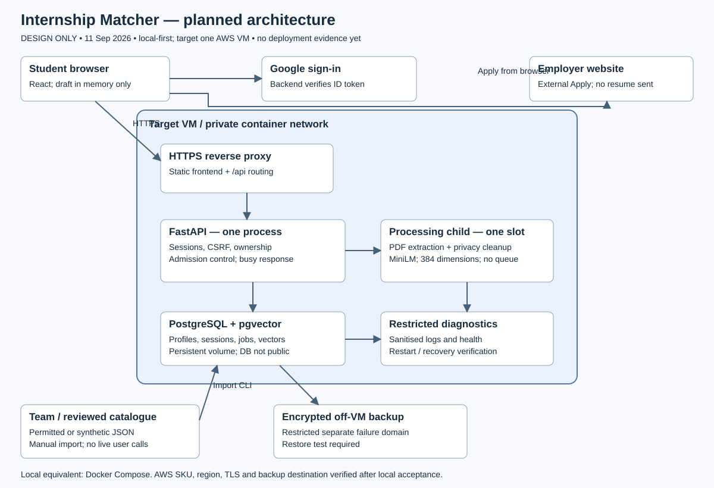

# INF2006-P1-G6

## Internship Matcher — implementation handoff

The team is building a local-first internship browsing app with resume-based semantic recommendations.
The local frontend/backend integration is implemented for localhost; cloud deployment remains pending.

Read in order:

1. [MVP PRD](docs/handoff/MVP_PRD.md) — scope and acceptance criteria.
2. [Architecture and decisions](docs/handoff/ARCHITECTURE.md) — editable diagram, reasoning and deployment boundary.
3. [Database/API contract](docs/handoff/DATA_API_CONTRACT.md) — schemas, endpoints, matching and safe retries.
4. [Implementation guide](docs/handoff/IMPLEMENTATION_GUIDE.md) — suggested ownership, three-week sequence and evidence gates.

[Design checkpoint](docs/DESIGN_CHECKPOINT.md) preserves the discussion history; the handoff consolidates its decisions.
The optional [JSearch research script](docs/JSEARCH_RESEARCH.md) is not the MVP. Do not commit credentials, real resumes or unlicensed provider data.

## Team and current state

Jiaxin and Chuying: backend. Xue E and Nasya: frontend. Zhihao: moderation, design and review. Proposed detailed ownership and environment preparation: [team setup](docs/handoff/TEAM_SETUP.md).

Implemented local stack: React/TypeScript, FastAPI/Python, PostgreSQL/pgvector, pdfplumber, Presidio, Sentence Transformers/MiniLM and Docker Compose. Use [the local integration runbook](docs/LOCAL_INTEGRATION.md) for startup, synthetic import and honest acceptance gates.



## Submission scaffold

| Path | Current status |
|---|---|
| project_manifest.yaml | Required keys present; official group ID/student IDs and actual results pending |
| src/ | Backend/frontend/infra boundaries and placeholder .env.example |
| data/ | Provenance instructions and data dictionary; dataset pending |
| analytics/ | Evaluation instructions; implementation pending |
| evidence/ | Planned figure and explicitly NOT RUN test templates |
| tests/ | Backend/frontend/fixtures/load boundaries; tests pending |
| TEAM_CONTRIBUTIONS.md | Planned roles, no fabricated completed contributions |
| AI_USE_DECLARATION.md | Documentation assistance declared; update during implementation |
| report.pdf | Not yet produced; working outline at docs/REPORT_DRAFT.md |
| video_link.txt | Optional; omitted until a real link exists |

Before final packaging, replace all pending results, export the 8–12 page report.pdf, and verify manifest paths against real artefacts. This scaffold is not submission-ready. No cloud resources created; no credentials required to read these documents. Do not include local scratch scripts in the final package without review.

Copy-paste coding-agent prompts: [teammate prompts](docs/handoff/TEAM_PROMPTS.md).

## Frontend and local runtime

The React/TypeScript shell has an explicit synthetic preview for frontend checks;
normal runtime uses the real API. Use Node 24.21.0 and npm 11.19.0:

```sh
cd src/frontend
npm install
npm run typecheck
npm test
npm run build
npm run dev:mock
```

The production-style Compose entry point is http://localhost:8080. It serves the
built React application and proxies same-origin `/api` requests to FastAPI. Real
Google login and the explicit synthetic catalogue import are documented in the
[local integration runbook](docs/LOCAL_INTEGRATION.md).

`npm run dev` uses the real API proxy at 127.0.0.1:8000. Configure only the public
Google client ID in src/frontend/.env.local. Production builds exclude fixtures.
The complete local MVP gate remains pending until Docker, isolated database/model,
and real Google checks run on an enabled host.

See [frontend integration and ownership](src/frontend/README.md),
[actual commands/results](src/frontend/MILESTONE_VALIDATION.md) and
[dependency notices](src/frontend/THIRD_PARTY_NOTICES.md).
