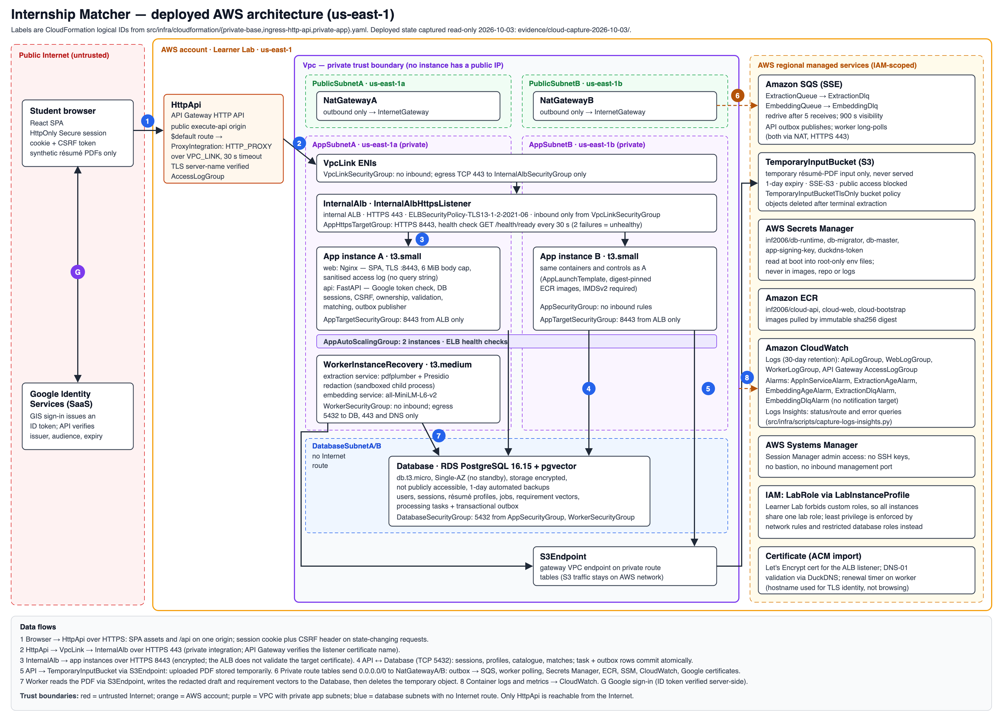

# Internship Matcher (INF2006 Team Project, Group P1-G5)

Students browsing internships struggle to tell which listings actually fit their skills, and keyword search misses
equivalent wording. Internship Matcher lets a student sign in with Google, upload a résumé PDF, review and approve a
privacy-redacted extraction, and then see internships ranked by **requirement-level semantic similarity**: every job
requirement is compared with the student's approved résumé content, and each recommendation shows which résumé
passage supports which requirement. The service runs on AWS behind a private, load-balanced, queue-backed
architecture.

**Team:** Jiaxin (backend: auth, database, API), Chuying (backend: résumé processing, embeddings, matching,
evaluation), Xue E (frontend: auth, catalogue, job details), Nasya (frontend: résumé review, recommendations),
Zhihao (system design, cloud deployment, review). Contributions: [TEAM_CONTRIBUTIONS.md](TEAM_CONTRIBUTIONS.md).

## Architecture



Editable source: [evidence/architecture.svg](evidence/architecture.svg). Browser → API Gateway HTTP API → VPC Link →
internal HTTPS ALB → two private web/API EC2 instances (Auto Scaling group, two AZs) → private RDS PostgreSQL/pgvector;
résumé extraction and embedding run asynchronously on a separate worker via SQS (with dead-letter queues) and a
temporary S3 bucket. Read-only configuration capture of the deployed stacks (2026-10-03):
[evidence/cloud-capture-2026-10-03/](evidence/cloud-capture-2026-10-03/).

## Quick start (local, offline-capable)

Prerequisites: Docker with Compose v2, Python 3.11, Node 24 / npm 11. Model weights are downloaded once on first build.

```sh
cp src/.env.example src/.env          # fill placeholder values locally; never commit src/.env
docker compose --env-file src/.env up -d --build
curl -fsS http://localhost:8080/health/ready
```

The app is at http://localhost:8080. Google sign-in needs your own OAuth Web client ID in `src/.env`; loading the
synthetic catalogue is described in [docs/LOCAL_INTEGRATION.md](docs/LOCAL_INTEGRATION.md).

Tests and evaluation (all offline; results recorded in [evidence/local-tests-2026-10-03.md](evidence/local-tests-2026-10-03.md)):

```sh
python3 -m unittest discover -s tests/infra -p 'test_*.py'
docker compose -f docker-compose.dev.yml --profile test build backend-tests
docker compose -f docker-compose.dev.yml --profile test run --rm backend-tests
(cd src/frontend && npm ci && npm run typecheck && npm test && npm run build)
python -m venv analytics/.venv && analytics/.venv/bin/pip install -r analytics/requirements.txt
analytics/.venv/bin/python analytics/evaluate.py --fixtures data/evaluation
```

Cloud deployment (requires an AWS account; billable, ~0.26 USD/hour while running): see
[docs/PRIVATE_CLOUD_ROLLOUT.md](docs/PRIVATE_CLOUD_ROLLOUT.md) and the templates in
[src/infra/cloudformation/](src/infra/cloudformation/). A marker does not need cloud access: configuration and dated
evidence are in `evidence/`.

## Technologies

React 19 + TypeScript (Vite), Nginx, FastAPI (Python 3.11), PostgreSQL 16 + pgvector, SQLAlchemy/Alembic,
pdfplumber, Microsoft Presidio, sentence-transformers `all-MiniLM-L6-v2`, Docker Compose; AWS API Gateway (HTTP
API + VPC Link), Application Load Balancer, EC2 Auto Scaling, RDS, SQS, S3, Secrets Manager, ECR, CloudWatch,
Systems Manager, CloudFormation; Google Identity Services.

## Where things are

| Path | Contents |
|---|---|
| [project_manifest.yaml](project_manifest.yaml) | Machine-readable summary and evidence paths |
| `src/` | `backend/` (FastAPI, workers, migrations), `frontend/` (React), `infra/` (CloudFormation, Nginx, bootstrap scripts), `.env.example` |
| `data/` | Synthetic catalogue and evaluation fixtures, [DATA_DICTIONARY.md](data/DATA_DICTIONARY.md), [README](data/README.md) (provenance) |
| `analytics/` | Evaluation script, pinned requirements, [README](analytics/README.md) |
| `evidence/` | Test records (`test-*.md`), [monitoring.md](evidence/monitoring.md), [threat-control-map.md](evidence/threat-control-map.md), cloud capture, diagrams |
| `tests/` | Backend, frontend, infrastructure, pipeline, analytics and load tests |
| [AI_USE_DECLARATION.md](AI_USE_DECLARATION.md) | AI tools used, where, and how outputs were verified |

## Known limitations

- **Single database instance.** RDS is Single-AZ with 1-day automated backups; there is no standby. A point-in-time restore
  was created and compared with the source (table list, pgvector extension, readable-table row counts; see
  [evidence/test-resilience.md](evidence/test-resilience.md) R5), but row contents, an application cut-over and
  recovery from older corruption were not tested. The web/API tier is redundant (2 instances, 2 AZs); the worker is a single instance.
- **Shared lab IAM role.** The Learner Lab forbids custom IAM roles, so all instances use `LabRole`; least privilege
  is enforced through security groups, private subnets and restricted database roles instead.
- **No alarm notifications.** CloudWatch alarms change state but have no SNS action.
- **Evaluation labels are provisional.** 210 of 300 relevance labels are AI-drafted; 90 were supplied by a team
  member. Metrics come from small synthetic fixtures and do not establish quality on real résumés.
- **Extraction errors.** PII detection can misclassify text (e.g. "Cloud Computing" tagged as a person); the student
  reviews and corrects the draft before saving.
- **Real job catalogue not redistributed.** The deployed catalogue (247 listings) was collected from LinkedIn and
  JSearch for the demonstration; it is excluded from this package because redistribution rights are not
  established. The package ships synthetic data only (see [data/README.md](data/README.md)).
- Four pipeline tests had drifted after the asynchronous refactor; they were fixed and the full pipeline suite
  passed (220) on 2026-10-03 (see [evidence/local-tests-2026-10-03.md](evidence/local-tests-2026-10-03.md), addendum).
- Response security headers (HSTS, CSP) are not set; the ALB does not validate the target certificate.

Historical design and handoff documents remain in `docs/` (for example [docs/handoff/](docs/handoff/)); where they
conflict with the deployed state, the evidence files and this README take precedence.
