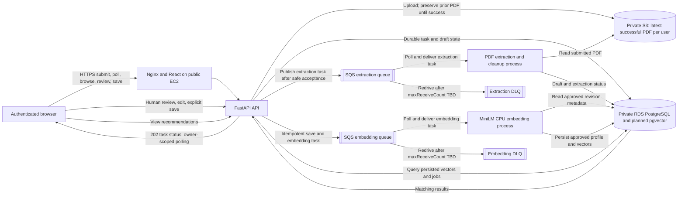
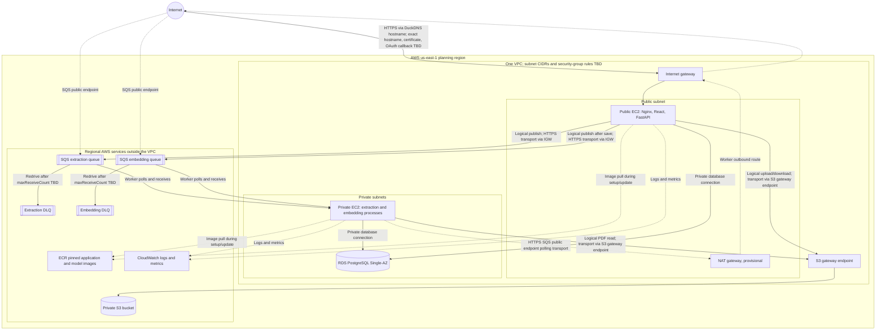

# Proposed cloud architecture (editable source)

**Status:** Proposed planning architecture, not deployed or verified. The PNG [`cloud-architecture-draft.png`](cloud-architecture-draft.png) is an inaccurate prior draft, retained but superseded by this Mermaid source.

## Logical workflow

The API must make task state and queue publication safely recoverable before returning durable acceptance. The specific consistency mechanism is unresolved. Extraction produces a reviewable draft; embeddings are queued only after explicit user save. Queue parameter values and cleanup interval are unresolved.

## Network placement

**Edge key:** labels identify logical workflow and transport paths. S3 and SQS are regional AWS services outside the VPC. The public API publishes to SQS through the internet gateway. The private worker polls SQS public endpoints through the provisional NAT gateway; S3 reads and writes use the separate S3 gateway endpoint. SQS redrives a message to its DLQ after the still-undecided `maxReceiveCount`; workers do not publish directly to DLQs. ECR access path, exact endpoint/security rules, and deployment-time image-pull design remain to be finalized.

RDS is planned Single-AZ. Its subnet group covers a second Availability Zone for placement; there is no standby database or HA claim. Learner Lab's supplied `LabRole` does not support a claim of custom per-component least-privilege roles. Enhanced Monitoring is unavailable in the lab; standard monitoring and CloudWatch logs/metrics are the current plan, with alarms still TBD.
