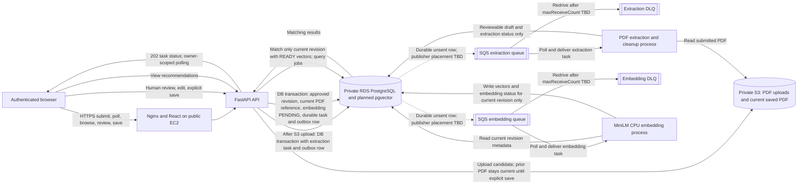
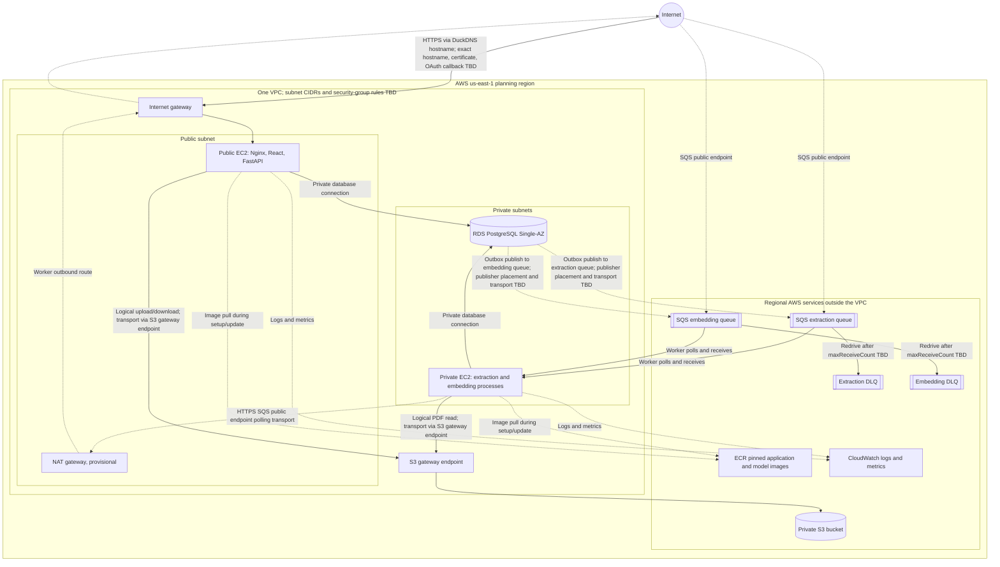

# Proposed cloud architecture (editable source)

**Status:** Proposed planning architecture, not deployed or verified. The PNG [`cloud-architecture-draft.png`](cloud-architecture-draft.png) is an inaccurate prior draft, retained but superseded by this Mermaid source.

## Logical workflow

**Proposed, not implemented or verified:** the API durably saves the reviewed content as a new approved revision, promotes that revision's already-uploaded S3 PDF reference in the same database transaction, sets embedding status to `PENDING`, and records its pending task and outbox instruction. The S3 object upload is not atomic with the database. Delete a previous PDF object only after the database reference change commits; abandoned review leaves the previous PDF current. A publisher retries durable unsent outbox rows and marks each sent only after SQS acknowledges; a crash after commit and before publish therefore leaves recoverable work. Duplicate publication remains possible and task handling must be idempotent. The same outbox pattern can accept an extraction task after the S3 object exists and the task/outbox transaction commits. Publisher placement is TBD and does not imply a new AWS service.

Extraction writes only the reviewable draft and extraction status; it is never the initial writer of approved content. The proposed processing policy allows up to three attempts total, including the initial attempt, for transient failures; an unusable PDF is terminal. SQS receive count does not equal worker execution count, so `maxReceiveCount` needs tuning with visibility timeout. The embedding worker writes vectors and embedding status only for the current revision, with the revision and task identity/status checked in the atomic database commit after computation. A retry creates a new task for the currently saved revision, reuses its PDF reference without reupload, and leaves the failed task unchanged. Late or obsolete workers discard results without changing current status. Reconciliation must distinguish queued work still waiting from stuck or failed work using task state/lease-aware checks; cadence, lease, and timeout remain TBD. If embedding fails, retain the approved content and PDF, expose a failed preparation state with retry, and keep matching unavailable. Matching may use only the current revision after its embedding status is `READY`, so stale vectors are never mixed with current content. Queue parameter values and cleanup interval are unresolved.

Resilience verification should cover a crash after database commit but before publication, duplicate publication, worker crash, attempt A completing after revision B is saved, an obsolete attempt completing after retry, and embedding failure retaining the reviewed content and PDF reference.

## Network placement

**Edge key:** labels identify logical workflow and transport paths. S3 and SQS are regional AWS services outside the VPC. The arrows from PostgreSQL to SQS represent the logical outbox publication path; the publisher's placement and transport are TBD, and the diagram does not add a separate AWS service or claim that the API request publishes directly. The private worker polls SQS public endpoints through the provisional NAT gateway; S3 reads and writes use the separate S3 gateway endpoint. SQS redrives messages according to a still-undecided `maxReceiveCount`, which counts receives rather than exact worker executions; retry count and visibility timeout need coordinated tuning. Workers do not publish directly to DLQs. ECR access path, exact endpoint/security rules, and deployment-time image-pull design remain to be finalized.

RDS is planned Single-AZ. Its subnet group covers a second Availability Zone for placement; there is no standby database or HA claim. Learner Lab's supplied `LabRole` does not support a claim of custom per-component least-privilege roles. Enhanced Monitoring is unavailable in the lab; standard monitoring and CloudWatch logs/metrics are the current plan, with alarms still TBD.
