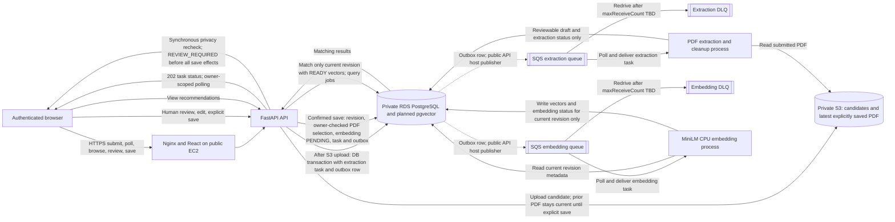
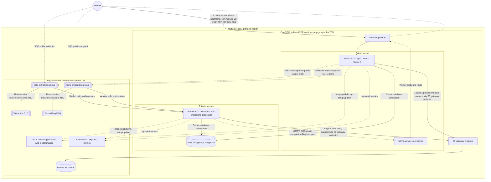

# Proposed cloud architecture (editable source)

> **Superseded proposal.** Use [cloud-target-final-2026-10-02.md](cloud-target-final-2026-10-02.md) and its SVG/PNG as the authoritative proposed target. This Mermaid document is retained as historical context; its permanent-PDF and single-public-host flows are not current requirements. The target is not deployed or verified.

**Historical status:** Proposed planning architecture, not deployed or verified. The PNG [`cloud-architecture-draft.png`](cloud-architecture-draft.png) is an inaccurate prior draft, retained for history.

## Logical workflow

```mermaid
flowchart LR
  B[Authenticated browser]
  API[FastAPI API]
  N[Nginx and React on public EC2]
  S3[(Private S3: candidates and latest explicitly saved PDF)]
  DB[(Private RDS PostgreSQL and planned pgvector)]
  EQ[[SQS extraction queue]]
  EDQ[[Extraction DLQ]]
  X[PDF extraction and cleanup process]
  V[[SQS embedding queue]]
  VDQ[[Embedding DLQ]]
  E[MiniLM CPU embedding process]

  B -->|HTTPS submit, poll, browse, review, save| N
  N --> API
  API -->|Upload candidate; prior PDF stays current until explicit save| S3
  API -->|After S3 upload: DB transaction with extraction task and outbox row| DB
  DB -.->|Outbox row; public API host publisher| EQ
  API -->|202 task status; owner-scoped polling| B
  EQ -->|Poll and deliver extraction task| X
  X -->|Read submitted PDF| S3
  X -->|Reviewable draft and extraction status only| DB
  EQ -->|Redrive after maxReceiveCount TBD| EDQ
  B -->|Human review, edit, explicit save| API
  API -->|Synchronous privacy recheck; REVIEW_REQUIRED before all save effects| B
  API -->|Confirmed save: revision, owner-checked PDF selection, embedding PENDING, task and outbox| DB
  DB -.->|Outbox row; public API host publisher| V
  V -->|Poll and deliver embedding task| E
  E -->|Read current revision metadata| DB
  E -->|Write vectors and embedding status for current revision only| DB
  V -->|Redrive after maxReceiveCount TBD| VDQ
  B -->|View recommendations| API
  API -->|Match only current revision with READY vectors; query jobs| DB
  DB -->|Matching results| API
```

**Proposed, not implemented or verified:** the API synchronously rechecks privacy before any save-side effect. If cleanup changes the draft, it returns `422 REVIEW_REQUIRED` and creates no revision, successful `SaveOperation`, embedding task/outbox, or PDF promotion until user reconfirmation. Confirmed save commits approved content, embedding `PENDING`, and owner-checked `upload_id` selection together. A non-null ID must be an owned current candidate tied to the expected revision. Null means manual save: no candidate is promoted; the separately identified latest explicitly saved original PDF is preserved with its source revision and labelled as an uploaded source that may differ from manual content. A first manual save has no PDF. `SaveOperation` becomes `SUCCEEDED` when approved content commits; embedding progress is task/revision state. The S3 upload is not atomic with the database. Remove an old object only after reference commit under the selected retention rule. A small publisher loop on the public API host retries unsent outbox rows and marks sent after SQS acknowledges; duplicate publication is idempotent.

Extraction writes only the reviewable draft and extraction status; it is never the initial writer of approved content. Up to three fresh processing claims are allowed for transient failures, including the initial claim; duplicate delivery under a valid lease does not increment the DB attempt count, while a new claim after crash/lease expiry does. A user retry creates a new task. SQS receive count is a safety net above the DB limit; terminal DB transitions delete the message, and final lease/DLQ reconciliation marks the task `FAILED`. Visibility exceeds the 60-second processing deadline plus S3/DB time or is extended. Embedding writes vectors/status only for current revision after atomic guard. Embedding retry reads saved content, not the PDF; extraction retry reads its candidate PDF. Late workers discard results. Matching uses only current-revision `READY` vectors. Exact lease/count/cleanup values remain to be selected.

Resilience verification should cover a crash after database commit but before publication, duplicate publication, worker crash, attempt A completing after revision B is saved, an obsolete attempt completing after retry, and embedding failure retaining the reviewed content and PDF reference.

## Network placement

```mermaid
flowchart TB
  Internet((Internet))
  subgraph AWS[ AWS us-east-1 planning region ]
    subgraph VPC[One VPC; subnet CIDRs and security-group rules TBD]
      IGW[Internet gateway]
      subgraph Public[Public subnet]
        API[Public EC2: Nginx, React, FastAPI]
        NAT[NAT gateway, provisional]
      end
      subgraph Private[Private subnets]
        Worker[Private EC2: extraction and embedding processes]
        RDS[(RDS PostgreSQL Single-AZ)]
      end
      Endpoint[S3 gateway endpoint]
    end
    subgraph Managed[Regional AWS services outside the VPC]
      S3[(Private S3 bucket)]
      Q1[[SQS extraction queue]]
      Q1D[[Extraction DLQ]]
      Q2[[SQS embedding queue]]
      Q2D[[Embedding DLQ]]
      ECR[ECR pinned application and model images]
      CW[CloudWatch logs and metrics]
    end
  end

  Internet -->|HTTPS via DuckDNS; hostname, cert, Google JS origin APP_ORIGIN TBD| IGW
  IGW --> API
  API -.->|Publisher loop from public host to SQS| Q1
  API -.->|Publisher loop from public host to SQS| Q2
  API -->|Logical upload/download; transport via S3 gateway endpoint| Endpoint
  API -->|Private database connection| RDS
  Q1 -->|Worker polls and receives| Worker
  Q2 -->|Worker polls and receives| Worker
  Worker -->|Private database connection| RDS
  Worker -->|Logical PDF read; transport via S3 gateway endpoint| Endpoint
  Endpoint --> S3
  Q1 -->|Redrive after maxReceiveCount TBD| Q1D
  Q2 -->|Redrive after maxReceiveCount TBD| Q2D
  Worker -.->|HTTPS SQS public endpoint polling transport| NAT
  NAT -.->|Worker outbound route| IGW
  IGW -.-> Internet
  Internet -.->|SQS public endpoint| Q1
  Internet -.->|SQS public endpoint| Q2
  API -.->|Logs and metrics| CW
  Worker -.->|Logs and metrics| CW
  API -.->|Image pull during setup/update| ECR
  Worker -.->|Image pull during setup/update| ECR
```

**Edge key:** labels identify logical workflow and transport paths. S3 and SQS are regional AWS services outside the VPC. The public API host runs the outbox publisher loop and reaches SQS over its internet-gateway route. The private worker polls SQS public endpoints through the provisional NAT gateway; S3 reads and writes use the separate S3 gateway endpoint. `maxReceiveCount` is a safety net above the DB attempt limit, not an execution count. ECR access path, exact endpoint/security rules, DNS update after lab restart, TLS challenge type, and image-pull design remain to be finalized. HTTP-01 requires port 80 for challenge and redirect; DNS-01 through DuckDNS TXT is an alternative. Google sign-in needs an HTTPS JavaScript origin configured as `APP_ORIGIN`, not a server OAuth redirect callback.

RDS is planned Single-AZ. Its subnet group covers a second Availability Zone for placement; there is no standby database or HA claim. Learner Lab's supplied `LabRole` does not support a claim of custom per-component least-privilege roles. Enhanced Monitoring is unavailable in the lab; standard monitoring and CloudWatch logs/metrics are the current plan, with alarms still TBD.
