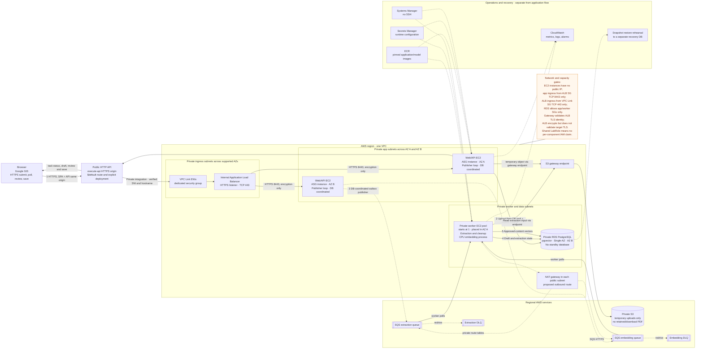

# Final proposed cloud target architecture

**Status: FINAL PROPOSED TARGET — NOT DEPLOYED / NOT VERIFIED.** The currently recorded foundation used one public web/API EC2 instance and RDS. This diagram describes the later target. It is intended for a synthetic-data demonstration; no real user or resume data belongs in coursework cloud resources.

**Dated status note (2026-10-03):** the operator later reported deployment of
this target's private base, ingress, and app stacks, plus partial acceptance
checks. See [`evidence/cloud-acceptance-2026-10-03.md`](../../evidence/cloud-acceptance-2026-10-03.md).
The remaining design narrative below records the 2026-10-02 planning snapshot,
including its then-current not-deployed statements. Use the dated evidence
record for current reported deployment status and open gates.

**Precedence:** this final target supersedes the retained-PDF/download proposal in [`docs/CLOUD_ARCHITECTURE.md`](../CLOUD_ARCHITECTURE.md) and [`docs/diagrams/cloud-architecture.md`](cloud-architecture.md). Those historical documents now carry supersession notices; this target is the current proposed architecture decision.

**Ingress:** the approved local target is a public API Gateway HTTP API → VPC Link → internal ALB HTTPS listener → private web/API instances over HTTPS 8443. Templates and scripts are preparation only; this path has not been deployed or verified. The dated SVG and PNG exports below are retained as historical public-ALB drafts and do not depict this ingress. The Mermaid source below is the current editable logical view. No AWS, DNS, Google OAuth, certificate, or production changes have been made.

## Agreed reference patterns

Retain Google GIS sign-in and database-backed application sessions, private Single-AZ RDS, SQS background work with DLQs, Secrets Manager, and CloudWatch logs/metrics/alarms. Cognito is deferred; SNS notification delivery is optional, not implemented or approved here. Lambda, DynamoDB, and CloudFront remain excluded. The execute-api HTTPS hostname serves the SPA and API at one browser origin. The two web/API instances and separate processing instance remain the compute target. S3/SQS code adapters are implemented locally; the cloud resources, deployment, and end-to-end acceptance remain unfinished.

Historical public-ALB draft exports: [SVG](cloud-target-final-2026-10-02.svg) and [PNG](cloud-target-final-2026-10-02.png). They are not the current ingress diagram.

## Flow and boundaries

1. The browser uses the execute-api HTTPS origin for both SPA assets and API requests. API Gateway's `$default` route forwards through a VPC Link to an internal ALB HTTPS listener. API Gateway validates the listener certificate against the configured DuckDNS name. The ALB re-encrypts traffic to Nginx on port 8443 but does not validate target certificates; network isolation limits that target path. Nginx forwards to FastAPI over the local container network. App EC2 instances have no public IPs.
2. The API uploads an extraction candidate to private S3 through an S3 gateway endpoint. After the upload succeeds, it commits the extraction task and outbox row to PostgreSQL. The API returns task status for browser polling. Candidate PDFs are temporary input only: delete them after terminal extraction or expiry, with an S3 lifecycle rule as a backstop. Exact retention remains to be set. There is no retained-PDF or download feature.
3. An outbox publisher loop runs on an app instance and publishes to the regional extraction or embedding SQS queue. It is part of the app deployment, not a separate service. Each queue has its own DLQ. Workers poll SQS; the database attempt count is authoritative and SQS receive count is only a safety net.
4. One private worker EC2 pool is proposed initially, placed in one AZ. It runs extraction/cleanup and CPU embedding processes, and writes extraction drafts and status to RDS. The single-AZ worker placement is not an availability claim. The extraction path reads the temporary PDF from S3.
5. Extraction creates a reviewable draft only. The user reviews and explicitly saves approved content. The embedding job reads that approved database content, guards against stale revisions, and writes vectors to pgvector; it does not read the PDF. The browser polls task state and uses the API for review and save.

RDS is private and Single-AZ. A subnet group spanning two Availability Zones only provides placement choices; it does not create a standby or replica. Rehearse snapshot restoration into a separate recovery database; this is a recovery path, not a live replica. Application and worker security groups are the only proposed database clients.

Private worker outbound traffic to SQS uses a proposed NAT gateway in each AZ; private S3 traffic uses the gateway endpoint. Confirm the actual lab supports the ALB, ASG, NAT, ECR, RDS, required TLS/domain setup, and needed instance capacity. The existing shared `LabRole` limits IAM claims: do not describe per-component least-privilege roles unless that boundary changes and is verified. Configure runtime secrets through Secrets Manager, administrative access through Systems Manager without SSH, and operations visibility through CloudWatch metrics, logs, and alarms.

The target has not been deployed or verified. Layered private base/worker/app templates and bootstrap helpers are now prepared locally; the safe preflight is in [`docs/PRIVATE_CLOUD_ROLLOUT.md`](../PRIVATE_CLOUD_ROLLOUT.md). Its exact TLS/domain and Google GIS origin, lab service capacity, shared-role permissions, S3 retention interval, queue retry/visibility settings, CloudWatch alarm thresholds, request timing, and restore evidence must be validated before making implementation claims. S3 uses a gateway endpoint on private route tables; NAT gateways are in the public subnets. This target does not add a permanent file feature, CDN, cache, Lambda, container orchestration, or a standalone publisher service. Browser-to-Gateway TLS and Gateway-to-ALB TLS are separate links; ALB-to-target TLS is encryption-only, and target-local Nginx-to-FastAPI remains HTTP.
