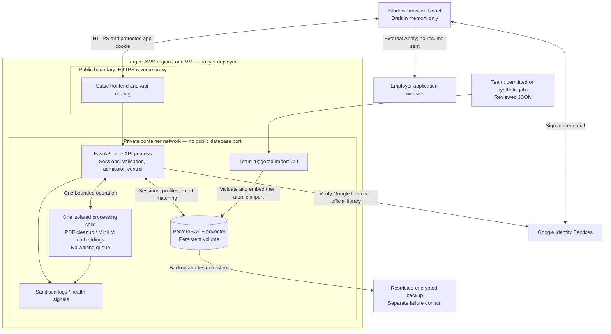

# Architecture and decision rationale

Status: target design, 2026-09-11. Nothing in this diagram is claimed deployed. Read [PRD](MVP_PRD.md) and [contract](DATA_API_CONTRACT.md).

## Logical and deployment diagram

Local equivalent: Docker Compose runs proxy/frontend, one API container and PostgreSQL. Processing child lives inside API container. Bind application to localhost; DB private to Compose network (optional development port only on loopback). No cloud connectivity needed except actual Google sign-in and initial dependency/model downloads. Synthetic fixtures and explicit test-only identity dependency make automated tests offline.

The external job API is intentionally absent from user request paths. The CLI is not a public admin endpoint. The senior diagram is a visual reference only; its load balancer/auto-scaling/S3 components are not our required architecture.

## Decisions

| Decision | Reason | Cost / limitation |
|---|---|---|
| React + FastAPI | Reuse app foundation; Python directly supports privacy and embedding libraries | Template authentication must be replaced; verify dependency compatibility |
| Direct Google + database sessions | No additional password or identity broker; immediate app logout | Team implements CSRF, ownership and expiry correctly |
| PostgreSQL + pgvector | Transactions keep content/vectors coherent; one datastore | Matching aggregation remains computational work |
| One VM initially | Three-week delivery, $50 budget, simple operations | Single failure domain; not high availability |
| Local-first Compose | Same component boundaries for development and deployment | Local timings are not AWS capacity evidence |
| Manual catalogue import | No scheduler, admin panel or hosted LLM dependency | Freshness requires team action |
| MiniLM locally | No per-request embedding provider; compact vectors | General similarity model, must evaluate domain quality |
| Exact matching first | Complete requirement aggregation, clear baseline | Cost grows with candidates × requirements × alternatives × chunks |
| One processing slot, no queue | Bound peak expensive work and prevent indefinite waiting | Bursts are rejected with retry guidance |
| Health/restart + backup/restore | Observable recovery within modest budget | Restore is not failover and may lose changes since backup |

Alternatives considered: managed PostgreSQL adds operational convenience but an additional bill and network configuration; defer until a measured need. Load balancer/auto-scaling adds servers and cost without removing per-instance embedding limits. Queue/worker service improves burst absorption but adds durable job state, polling and raw-data lifecycle complexity. MongoDB is unnecessary for this schema. HNSW is not a drop-in replacement for the multi-requirement aggregate; do not add approximate retrieval without recall evaluation.

## Processing topology and timeout

Run exactly one API process initially. Admission is nonblocking and process-wide, shared across PDF preparation and embedding. One child process loads privacy/embedding resources once and performs CPU work off the API event loop. Never submit to an executor queue before acquiring the slot. Configure ML library thread count conservatively (initially 1).

Routine defaults: preparation/embedding child deadline 60 seconds; reverse proxy 90 seconds; client 100 seconds. On child deadline, terminate and join that child before releasing admission, recreate it, and report safe failure. Do not pretend cancelling an async task terminates CPU computation. Database transactions have short statement/lock timeouts (5 seconds) and never include model inference. Client disconnect alone must not release a still-running slot. Save outcomes are resolved through idempotency.

Reject oversized bodies while streaming; proxy multipart body cap 6 MiB, PDF part cap exactly 5,242,880 bytes, one file, at most 10 pages (routine abuse-control default). Count upload admission before consuming the PDF; stream to bounded memory, never use a framework spool-to-disk default unnoticed. Parsing occurs in a restricted child without network access. Clear references after processing; no persistent PDFs or raw text. Pre-download the pinned model during image build; readiness requires cached weights and successful model load, so the restricted child needs no network. Memory cleanup is lifecycle minimisation, not a guarantee of forensic erasure. Model caches contain weights only.

## Extraction without a hosted LLM

Use deterministic heading/bullet parsing for Skills, Projects, Experience and Education after privacy cleanup. Preserve the cleaned source meaning; do not fabricate structured achievements from prose. Return uncertain/unclassified cleaned paragraphs in a transient `unassigned_text` field of the prepare response and flag `SECTION_REVIEW_NEEDED`. The review screen lets the student assign/copy these into project/experience entries or omit them. This field is not part of saved ResumeContent and is never embedded directly. Do not silently lose paragraphs because a heading was unfamiliar. Skill token guesses require student confirmation before they become explicit skill evidence.

## Privacy and trust boundaries

Use pdfplumber extraction, Presidio plus configured recognizers and app-specific rules. Remove names/contact identifiers, emails, phone numbers, addresses, IDs and unnecessary links; configure Singapore phone and ID cases. Do not blindly remove every location token or claim perfect anonymisation. Review original and edited output against synthetic PII fixtures. Final save re-runs cleanup: if it changes submitted content, return cleaned draft for reconfirmation (422), rather than silently saving unseen changes. No vector generation before final review acceptance.

No secrets or raw input in logs, traces, filenames, exception responses or analytics. Request IDs are generated server-side; do not trust arbitrary client strings. Diagnostics record stage, duration, sanitized exception class/trace, version, status. Never log exception locals or raw parser/library messages. Restrict log access; initial retention seven days. Account ownership is derived from session, never request user_id. Frontend private responses use Cache-Control: no-store and private caches are cleared on logout.

## Local acceptance and cloud boundary

Initial test targets, not measured results: browse p95 <1 second and matches p95 <2 seconds on a documented local machine with 1,000 synthetic jobs; busy response <1 second; single admitted processing completes within 60 seconds for supported fixtures. Record idle/warm/cold conditions, hardware and failures. Repeat with 10,000 jobs as a stress experiment; no pass claim required there. Growth data must include requirement/alternative/chunk counts, not just number of jobs.

No cloud resources created until local gate passes and deployment is approved. Target one VM with persistent PostgreSQL volume, HTTPS, closed DB port, minimal inbound access and encrypted backups outside that VM. VM product/size, region availability, backup destination and exact cost are a release-time checklist, not blockers to localhost work. Do not assume free tier or $50 credit covers every service. Estimate compute, disk, IP, backups, logs, transfer and idle days; target <=$40 leaving $10 contingency. Alerts do not enforce a spending cap. Configure a process restart policy for actual process exits. A Docker healthcheck alone does not restart an unhealthy running container: use an explicit supervisor action or controlled fail-fast for unrecoverable processing-child failure, and test recovery. Test restore and export evidence before decommissioning; retained disks/backups/IPs can still cost money.

## Sources and evidence boundary

- [MiniLM model card](https://huggingface.co/sentence-transformers/all-MiniLM-L6-v2): 384 dimensions, default 256 wordpiece truncation, Apache 2.0. Pin revision during bootstrap.
- [pgvector](https://github.com/pgvector/pgvector): vector storage and exact cosine distance.
- Authoritative supplied INF2006 brief, sections 4–5 and rubric: working cloud service, persistent cloud data, meaningful AI, security, monitoring and implemented scaling/resilience mechanism with evidence. No mandated 100-user capacity or load balancer.
- [Historical design checkpoint](../DESIGN_CHECKPOINT.md): detailed approvals and source inspections. No benchmark or live deployment has been performed by this handoff.
