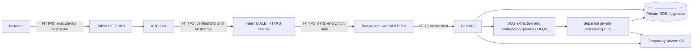

# API Gateway private ingress: assessment and approval plan

Status: APPROVED FOR LOCAL IMPLEMENTATION PREPARATION ONLY. No AWS, DNS, Google OAuth, certificate issuance/import, deployment, or production operation is authorized by this status. The local template, scripts, tests, and documentation are preparation artifacts only; cloud creation and each external side effect require a separate concrete approval.

**Dated status note (2026-10-03):** the operator later reported that the private
base, ingress, and app stacks were deployed, with partial acceptance evidence.
See [`evidence/cloud-acceptance-2026-10-03.md`](../../../evidence/cloud-acceptance-2026-10-03.md).
The status and remaining gates below preserve this plan's original approval
scope; use the dated evidence record for the reported current cloud state.

## Recommendation and brief fit

Adopt a public API Gateway **HTTP API** with private ALB integration as the proposed ingress. Its execute-api HTTPS origin serves both the SPA and API. Retain two private web/API EC2 instances, one private processing EC2, temporary S3, SQS/DLQs, private Single-AZ RDS/pgvector, NAT egress, ECR, Secrets Manager, SSM and CloudWatch. No Cognito, Lambda, DynamoDB or CloudFront addition. The full target stack, async adapters, and two-instance app deployment remain unfinished.

The original local `INF2006_Team_Project_Brief_2026.pdf` was read directly. Section 4 allows technology choices and requires functioning workflow, cloud compute, persistent data, interpretable analytics, at least one resilience mechanism, security and operations evidence. It does not require a purchased domain, Cognito, Lambda, API Gateway or DynamoDB. This design retains those capabilities but proves none until tested. Section 5.1 requires two alternatives and cost/constraint rationale: compare public ALB plus a CNAME-capable domain (simpler ingress, unavailable domain today), and CloudFront (side-chat access denied; unsupported-list observation, not universal AWS limitation). Section 5.2 still requires functional, security, data/AI and resilience/recovery tests. Section 9 requires reproducible, dated, redacted evidence independent of a live account.

Side-chat findings are user-reported, not independently repeated here: CloudFront ListDistributions denied and absent from the supported-services list; API Gateway listed and API/VPC Link inventories readable. Inventory access does not prove create/update/delete permissions. No additional cloud inspection was performed for this document.

## Verified documentation and remaining TLS uncertainty

AWS supports `HTTP_PROXY`, `VPC_LINK`, and an ALB **listener ARN** as integration URI. Specify payload format `1.0`, method `ANY`, and `TlsConfig.ServerNameToVerify=internshipmatcher.duckdns.org`. The name is used for hostname validation and SNI. **Inference from these documented fields:** public DuckDNS A/CNAME routing to the ALB is unnecessary; the listener ARN selects the destination. This exact deployment is untested. [Private integrations](https://docs.aws.amazon.com/apigateway/latest/developerguide/http-api-develop-integrations-private.html), [TLS configuration](https://docs.aws.amazon.com/apigateway/latest/developerguide/api-gateway-extensions-integration-tls-config.html).

DuckDNS documents TXT records applying to sub-subdomains, supporting `_acme-challenge.internshipmatcher.duckdns.org`. DNS-01 can validate a name whose server is not public. Domain control is **not yet confirmed**: first inspect the signed-in domain inventory without displaying its token; actual challenge issuance is a separately approved DNS write. Do not change A/AAAA records or invoke the IP-update helper. [DuckDNS TXT API](https://www.duckdns.org/spec.jsp), [Let's Encrypt challenges](https://letsencrypt.org/docs/challenge-types/).

Use an ACM-compatible RSA-2048 leaf certificate with matching SAN, private key and complete intermediate chain, imported in the ALB region. AWS's backend certificate guidance explicitly mentions Let's Encrypt, but a search of the published supported-CA list did not find ISRG. Therefore public browser trust alone is insufficient evidence of API Gateway trust. Record the issued chain/root and prove the actual private-integration handshake before proceeding with the full deployment. Staging ACME certificates are for renewal tests only; they are not publicly trusted production certificates. No HTTP or verification-disabled fallback. [AWS backend certificate guidance](https://docs.aws.amazon.com/apigateway/latest/developerguide/getting-started-client-side-ssl-authentication.html), [supported CAs](https://docs.aws.amazon.com/apigateway/latest/developerguide/api-gateway-supported-certificate-authorities-for-http-endpoints.html), [Let's Encrypt chains](https://letsencrypt.org/certificates/).

Browser-to-Gateway TLS uses the AWS execute-api certificate, independent of the DuckDNS certificate. Gateway-to-ALB TLS validates the DuckDNS name. Existing `web-cloud.conf` listens on HTTP 8080; the private mode uses a separate Compose file and Nginx configuration on 8443. Each app host creates a local self-signed target certificate outside the image; ALB encrypts target connections but does not validate those target certificates, so security-group isolation remains important. No port-8080 fallback is configured in private mode. Loopback/container-local Nginx-to-FastAPI HTTP remains an explicit within-host boundary.

## Concrete implementation sequence after approval

1. **Read-only prerequisite check.** Confirm DuckDNS ownership without exposing credentials. Check actual AZ IDs, subnet space, quotas, LabRole capability and applicable service-linked-role/ENI permissions. Required operations include API Gateway API/stage/route/integration/VPC Link CRUD, ELB listener/target group/SG changes, ACM ImportCertificate/DescribeCertificate/reimport, CloudWatch logging and Secrets Manager access. Static policy or inventory visibility cannot guarantee a successful create. Any capability probe that creates resources needs separate deployment approval.
2. **Local infrastructure preparation — complete, unverified in AWS.** Added `src/infra/cloudformation/ingress-http-api.yaml`, preserving the historical foundation template. It defines HTTP API, `$default` stage/route, VPC Link, dedicated internal ALB HTTPS listener, HTTPS target group for two supplied app instance IDs, and a restricted security-group path from VPC Link → ALB 443 → app targets 8443. Each new SG uses CloudFormation's documented loopback egress sentinel to suppress default allow-all egress; standalone rules provide only the required 443/8443 paths. The target group checks HTTPS `/health/ready`; its ACM leaf certificate ARN and hostname are explicit parameters. The execute-api endpoint stays enabled; each route/integration release requires a new `DeploymentR<n>` logical ID and stage reference; throttling and sanitized access logs are configured. No gateway authorizer or CORS policy is added: existing application session/CSRF enforcement remains authoritative and the browser uses one origin. [Security-group egress behavior](https://docs.aws.amazon.com/AWSCloudFormation/latest/TemplateReference/aws-resource-ec2-securitygroup.html).
3. **Network/app stack — still a cloud prerequisite.** The template uses the existing VPC, two eligible private subnets and two existing app instance IDs. Attach its output app-target SG to both instances alongside required dependency/egress groups, and inspect existing SG ingress so broad rules do not defeat the narrow ALB source rule. Required path: Link SG egress to ALB SG TCP 443 only; ALB ingress from Link SG TCP 443 only; ALB egress to app-target SG 8443 only; app-target ingress from ALB SG TCP 8443 only; DB ingress from app/worker SGs only. Private app mode exposes Nginx on 8443 and generates per-host self-signed certificates; ALB encryption to targets does not validate these certificates. VPC Link SGs/subnets are immutable and require replacement if wrong. us-east-1 supported AZ IDs currently list use1-az1, az2, az4, az5, az6; map account AZ names to IDs rather than assume `1a` is eligible. NAT remains for outbound dependencies. [VPC Link lifecycle and AZs](https://docs.aws.amazon.com/apigateway/latest/developerguide/apigateway-vpc-links-v2.html).
4. **Configuration and certificate tooling — locally prepared.** Dedicated DNS-01 and ACM import/reimport scripts do not change the old HTTP-01 foundation activation path. The helper safely reads the root-owned mode-0600 `/etc/inf2006/ingress-acme.env` for manual and systemd invocations. First production issue imports a new ACM certificate without an ARN and prints the returned ARN; later renewal/reimport requires and reuses that ARN. `APP_ORIGIN` is validated as an exact HTTPS origin independent of `TLS_SERVER_NAME`; legacy `PUBLIC_HOSTNAME` equality remains enforced in foundation mode. Target `APP_ORIGIN` is the execute-api origin with no trailing slash or stage path. Both app instances must receive the same signing key, Google client ID and database-backed sessions. Google Authorized JavaScript origin must use this public origin, not DuckDNS. Changing Google settings is an external action requiring approval.
5. **Local compatibility and timing checks.** Test proxy config, bootstrap variable separation, source/build asset sizes, and application regressions with synthetic inputs. Measure cold and warm privacy-check/save latency on the intended app instance class before accepting the 30-second integration ceiling. Suggested engineering gate: all bounded test cases below 25 seconds, including contention; this is a proposed margin, not a brief requirement or measured result. If unmet, stop and propose asynchronous privacy validation/save with explicit status semantics; never skip checks or assume Nginx's current 90-second timeout overrides API Gateway.
6. **Separate approval for a minimal cloud proof.** Present exact resources, permissions, DNS TXT operations, cost estimate, rollback and teardown. Then test the certificate/private integration before deploying all workers/data services. Test wrong server name/certificate failure with a temporary test integration, not the working route. Only after this passes approve/perform the full target deployment and application acceptance. The previously approved local task foundation does not provide AWS S3/SQS adapters or a completed multi-instance cloud template; those remain separate implementation work.

## Compatibility acceptance matrix

| Area | Existing evidence / required acceptance |
|---|---|
| Uploads | Code enforces 5,242,880-byte PDF and 6 MiB multipart limits, under Gateway's 10 MB payload limit. Send near-limit binary multipart; verify exact bytes/hash, content type/boundary and expected 413 for over-limit bodies. No Lambda base64 envelope is involved. |
| Assets and paths | Serve `/`, JS/CSS/fonts/images and SPA deep-link refresh through the same proxy. Check MIME, gzip/content-encoding, redirects, query strings, percent encoding and missing-asset behaviour. Confirm each response is below gateway limits; inspect actual build output. |
| Auth and CSRF | Existing code uses host-only Secure HttpOnly SameSite=Lax cookies, production `__Host-session`, Path=/ and exact Origin checking. Test Google bootstrap/exchange, multiple Set-Cookie headers (delete pre_login plus set session), cookie reuse across both instances, X-CSRF-Token, Origin/Authorization forwarding, logout/204, expiry, wrong-origin and two-user isolation. Preserve shared DB session storage; no sticky sessions needed. |
| Proxy trust | Test Host, Forwarded/X-Forwarded-* and scheme handling; do not trust arbitrary client forwarding headers for identity or redirects. Confirm ALB listener does not require the browser Host to equal the certificate SNI name. |
| Responses | Preserve 200/202/204, API 4xx/5xx, JSON errors and cache-control. Gateway-generated 429/502/504 may have different bodies: frontend must show a bounded retryable error and preserve polling/task recovery. A timeout must not cause duplicate saves. |
| Timing | Upload, auth verification and synchronous save/preview/privacy checks all fit 30 seconds. Measure cold model loading and concurrent requests; async extraction alone does not prove compliance. |
| Limits | HTTP API documented ceiling: 30 seconds, 10 MB payload, 10,240 bytes request line+headers. Cookies/headers must stay below it. [Quotas](https://docs.aws.amazon.com/apigateway/latest/developerguide/http-api-quotas.html). |
| Failure/operations | Remove one app target and observe continued service; worker retry/DLQ and restore tests remain required by chosen design. Capture Gateway integration errors/latency/throttling, ALB target health, worker queue age and certificate expiry without logging credentials, cookies, PDF bodies or token URLs. |

## Renewal and trust lifecycle

ACM does not auto-renew imported certificates. A scheduled systemd timer on the existing worker (not a fourth instance/Lambda) should run an ACME client with a dedicated DuckDNS TXT hook, a lock to avoid concurrent challenges, authoritative DNS propagation checks and bounded retries. Fetch the token securely from Secrets Manager; never place it in command arguments, verbose HTTP output or logs. Store ACME account state/key material encrypted with restricted access and a documented recovery procedure; do not put it in the temporary-PDF bucket. The shared LabRole means per-component least privilege cannot be claimed.

Check daily using the client's renewal-due logic and the actual certificate expiry; do not hardcode a 90-day lifetime. On renewal, validate SAN, validity, key match and chain, then reimport **to the existing ACM ARN** to preserve listener association. Verify ACM metadata and the public application handshake after reimport. Alert on renewal failure and expiry thresholds (proposed 30/14/7 days, adjusted to issued lifetime). A stopped lab worker cannot renew: session-start preflight must check expiry and renew before service acceptance. Test staging issuance/renewal and failure handling, then production reimport with matching key type and an actual Gateway handshake. Keep the currently valid certificate on failed renewal and fail closed at expiry. [ACM import/renewal responsibility](https://docs.aws.amazon.com/acm/latest/userguide/import-certificate.html).

## Cost, rollback and approval boundaries

Planning-only baseline: approximately **$155.44/month** at 730 hours for three `t3.small` instances, an ALB, two NAT gateways/public IPv4s, 60 GiB gp3, and a 20 GiB Single-AZ RDS instance. This combines currently published EC2, ALB, IPv4 and EBS rates with RDS and NAT rates that remain regional assumptions; it is not a quote and excludes ALB LCU (about $5.84/month at one average LCU), API requests (first pricing tier $1/million in 512 KiB increments), data transfer, ECR storage, Secrets Manager, CloudWatch ingestion, snapshots, tax, and compute-credit effects. No free-tier assumption. Recheck every input in the AWS calculator before any execution approval. Sources and assumptions are recorded in `src/infra/README.md`.

Rollback local changes independently of unrelated work. After an approved cloud trial, remove the trial route/integration/API, then VPC Link after dependencies are released, and only tagged trial ALB/targets/certificate resources. Preserve shared ECR, lab resources, existing EIPs and required evidence. DNS cleanup only removes/restores the specific owned challenge TXT value after checking no other issuance is running; never clear unrelated domain records. Full teardown must also stop renewal automation and account for retained logs, secrets, EBS and RDS snapshots. Export redacted evidence before removal.

**Local implementation is approved and prepared.** Cloud creation, certificate issuance/TXT updates, ACM import, Google OAuth changes and deployment remain held for a separate concrete execution approval. First unresolved gates: DuckDNS control, effective create/import permissions, real certificate trust, Google-origin acceptance, and measured request timing.

## Verification of this assessment

Local preparation includes `src/infra/cloudformation/ingress-http-api.yaml`, a target HTTPS Nginx listener, separate origin/TLS bootstrap settings, and explicit DNS-01/ACM scripts. Offline verification covers template shape, Nginx mapping and mocked DNS hook behavior only. No runtime latency, target-instance browser compatibility, issuance, renewal, real chain trust, cloud permission, Google origin or deployment test was performed. DuckDNS TXT values share the domain across subdomains. Auth refuses to overwrite a different TXT value, checks every authoritative nameserver, and cleanup clears TXT only after confirming the exact challenge value is the sole current record. The request includes both `txt=<challenge>` and `clear=true`; it does not use DuckDNS's generic address-record clear path. Ownership and actual DNS propagation remain unverified.

Certificate mutations require `--apply`. Certbot requests RSA-2048 and scopes renewals by certificate name. The first production import can create a new ACM ARN; later reimports target that ARN. Import supplies leaf `cert.pem`, private key and `chain.pem` separately after local SAN, trust-chain and key-match validation. No actual ACM import or API Gateway trust handshake occurred.
